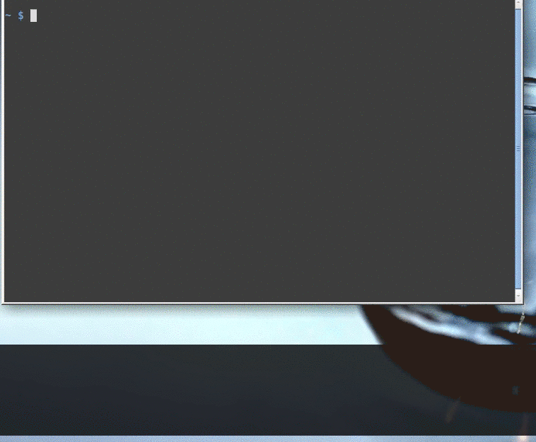

# Command Line Stack for Bash

## Introduction

In Bash, there is no built-in function to remember a half-typed command-line and restore it later. Although many workarounds have been devised (see [here](https://unix.stackexchange.com/questions/10825/remember-a-half-typed-command-while-i-check-something) for them), they are relatively complex.

This `command_line_stack.sh` is quite simple. You can remember or restore a command-line just with one key which is defaulted to <kbd>Ctrl</kbd>+<kbd>b</kbd>.

- When you press the key with a non-empty command-line, it is remembered and the command-line is cleared out to let you input another command. 

- When you press the key with an empty command-line, the last backed up command-line is restored.

Since the script internally implements stack data structure (LIFO), arbitrary number of command-lines can be remembered and they are restored in the reverse order.

## Demo

Just <kbd>Ctrl</kbd>+<kbd>b</kbd> to remember/restore command-lines.

This demo was created with the great software [screenkey](https://gitlab.com/wavexx/screenkey).

## Installation

Let `<path>` be the path to `command_line_stack.sh`.

To temporarily enable the script, execute `source <path>`. By this, the functionality is enabled only for the current session.

To permanently enable the script, load it from the initialization file. For example, write `source <path>` to your `~/.bashrc`.

## Usage

Press <kbd>Ctrl</kbd> + <kbd>b</kbd>. There is nothing more than this to do.

The script is tested under both vi mode (`set -o vi`) and emacs mode (`set -o emacs`).

